<!--
    
-->
<!--
    
-->

    

        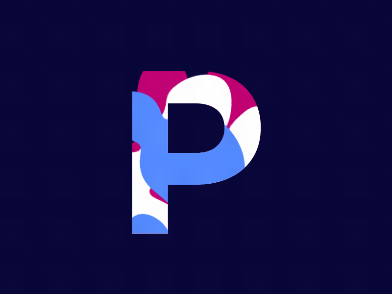
        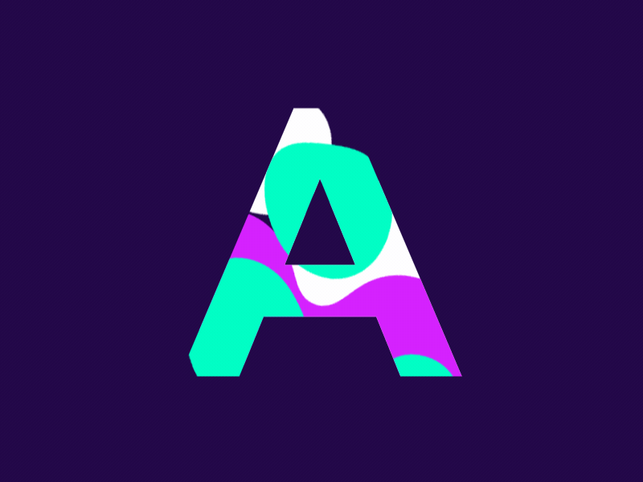
        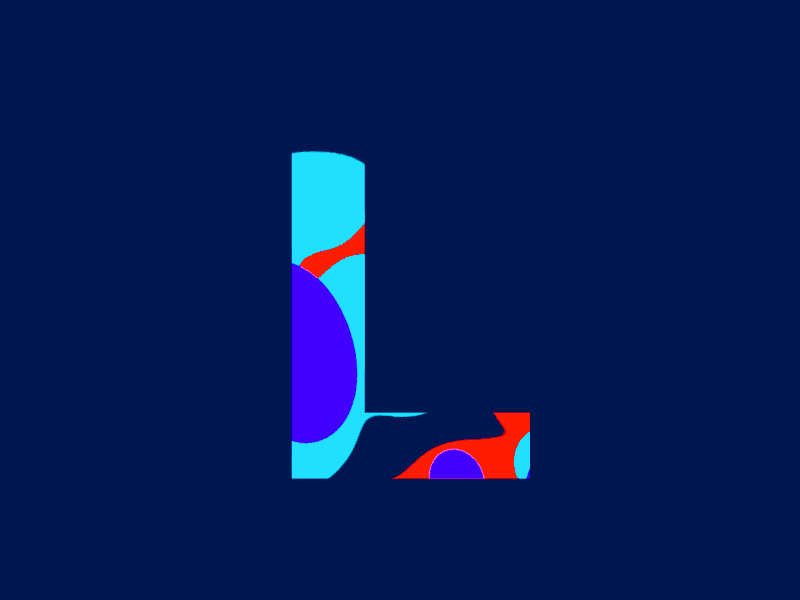
        
        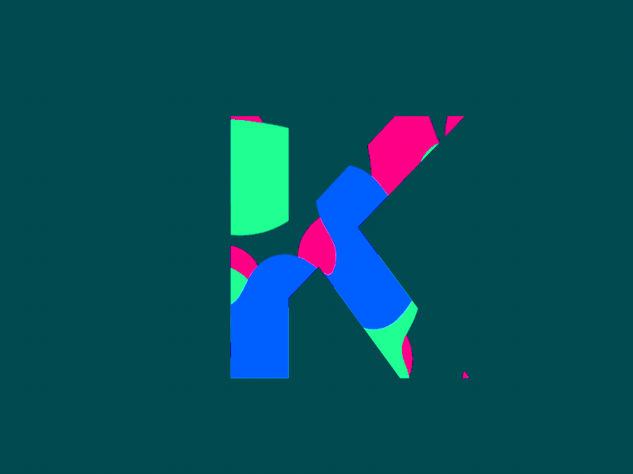
    

    

        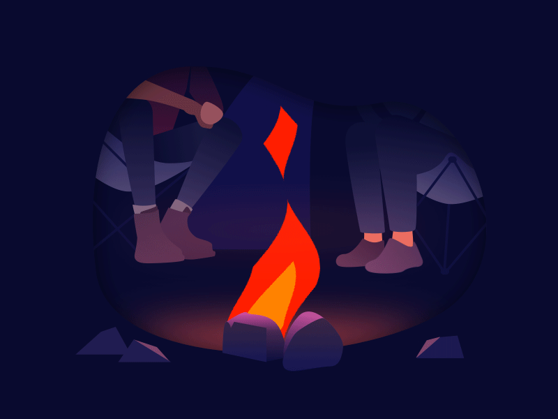
        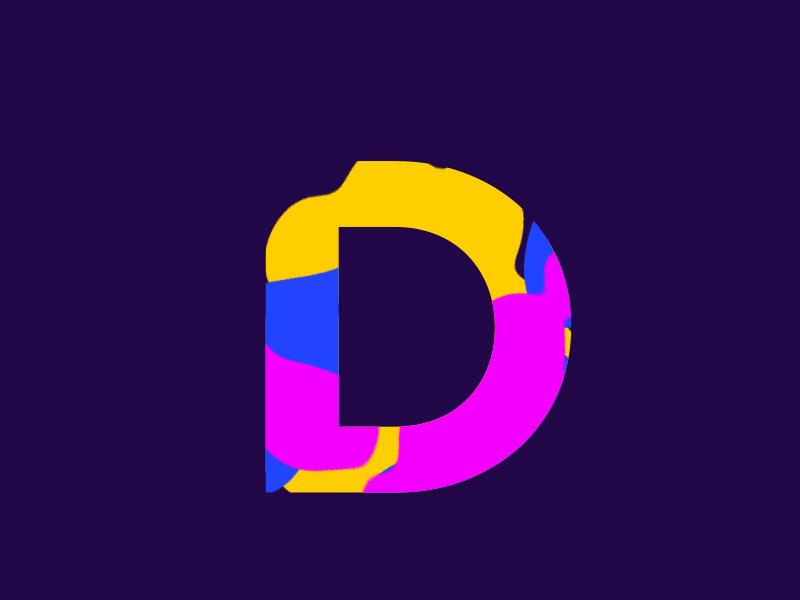
        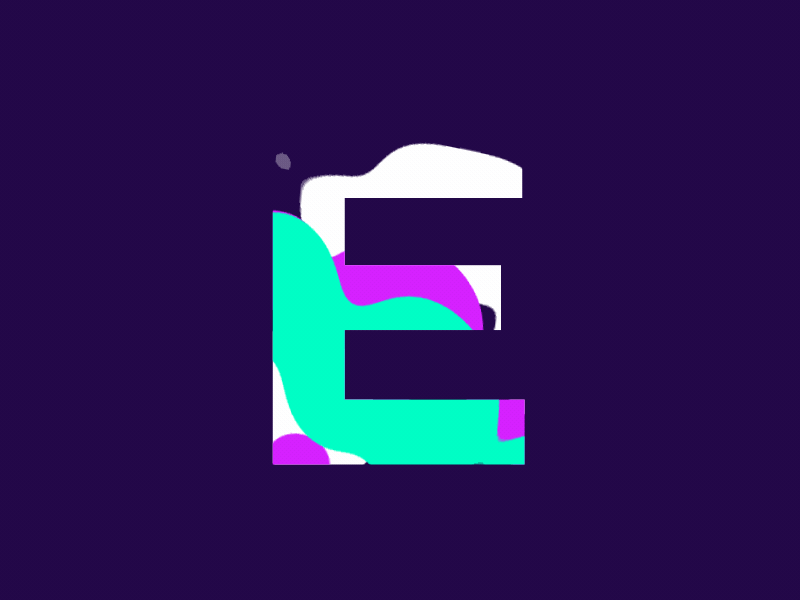
        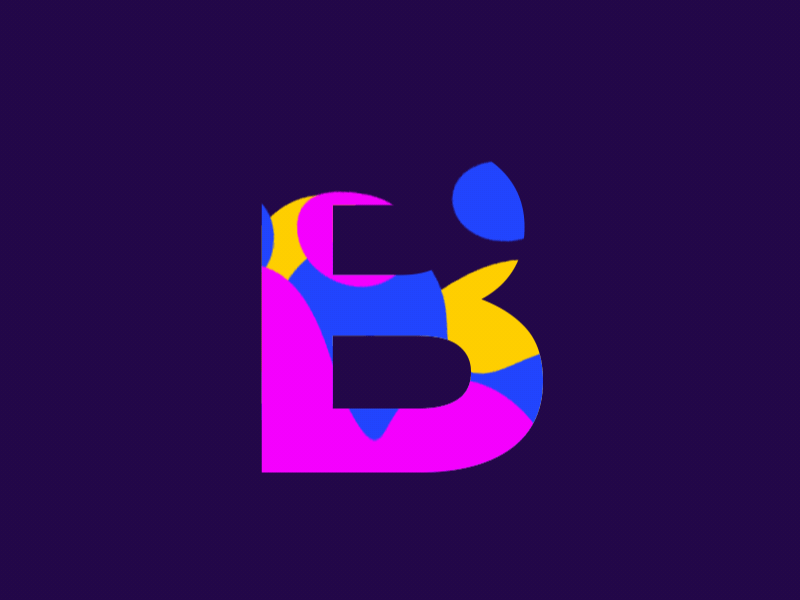
        
    

    

        
        
        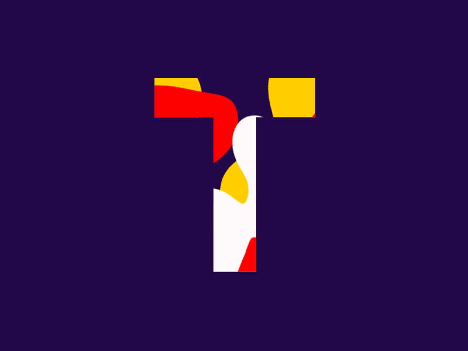
        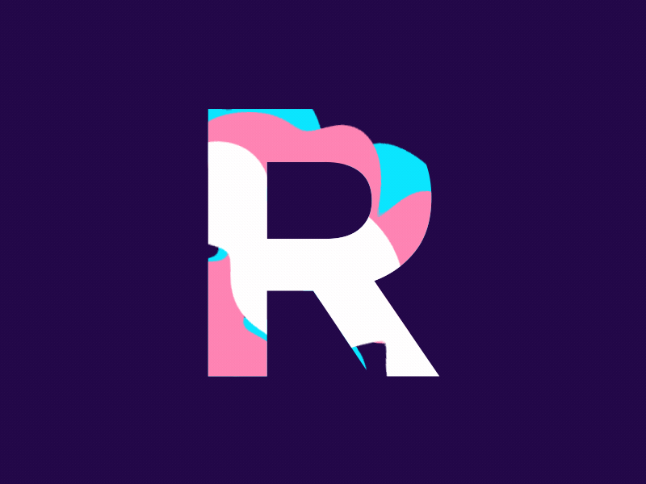
        
    

    ❄️ CS Afficionado 🧿 ML Developer 💎 NLP Wizard

<h4 align="center">LANGUAGES</h4>

  
  
  
  
  
  
  

 

<h4 align="center">TECH STACKS</h4>

  
  
  
  
   
  
  
  
  
  
  
  
  
  
  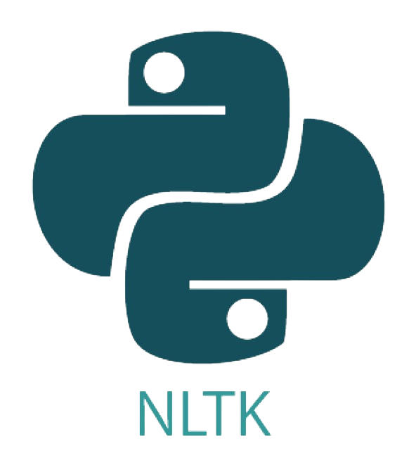
  
  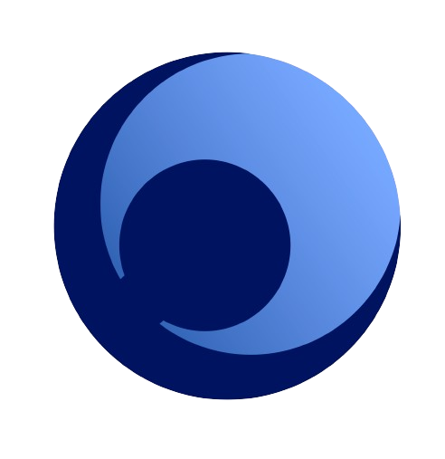
  
  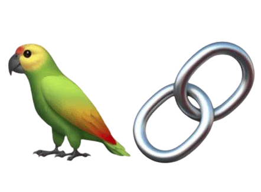
  
  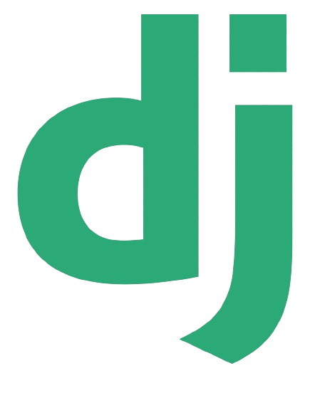

 

<h4 align="center">SOFTWARE</h4>

  
  
  
  
  
  
  
  
  
  
  

 

<h4 align="center">LINKS</h4>

 

###
