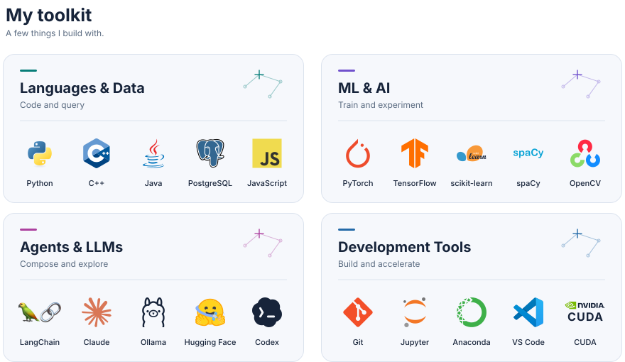

<!--
    
-->
<!--
    
-->

    

        
        
        
        
        
    

    

        
        
        
        
        
    

    

        
        
        
        
        
    

 

<!-- 

  

 -->

  <picture>
    <source media="(max-width: 600px) and (prefers-color-scheme: dark)" srcset="Icons/toolkit-dark-mobile.svg" />
    <source media="(max-width: 600px)" srcset="Icons/toolkit-light-mobile.svg" />
    <source media="(prefers-color-scheme: dark)" srcset="Icons/toolkit-dark-desktop.svg" />
    
  </picture>

<!-- 

  

 -->

<!-- 

  
  
  

 -->

  

