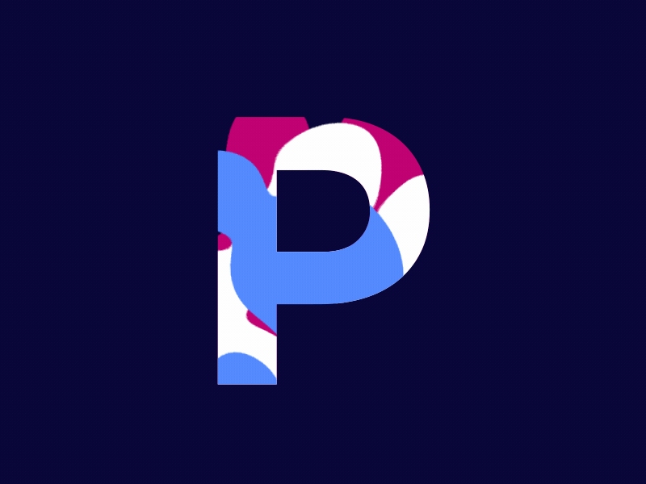
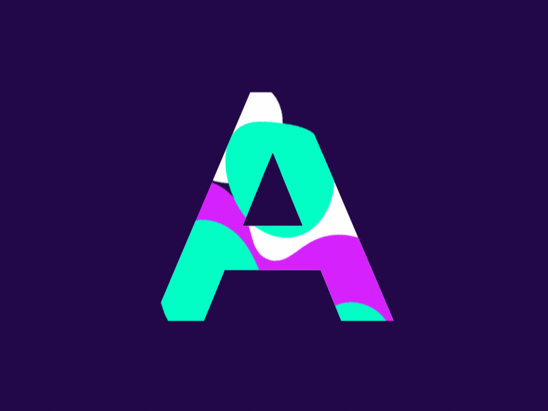
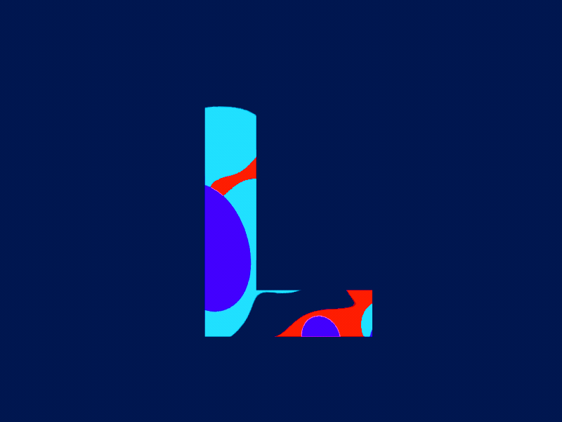
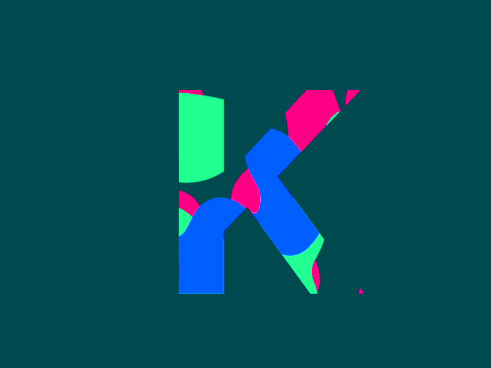
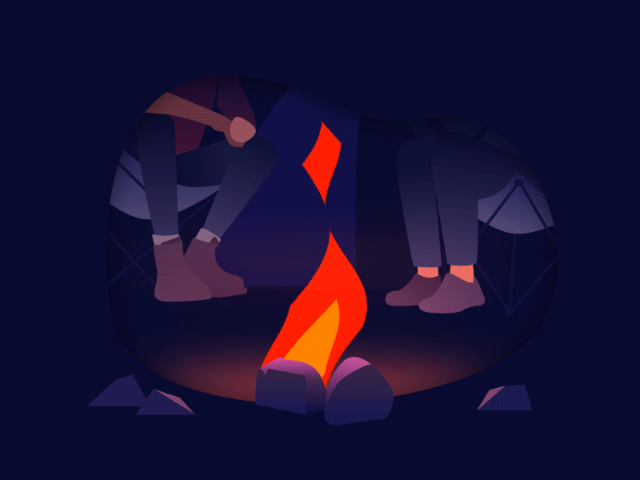
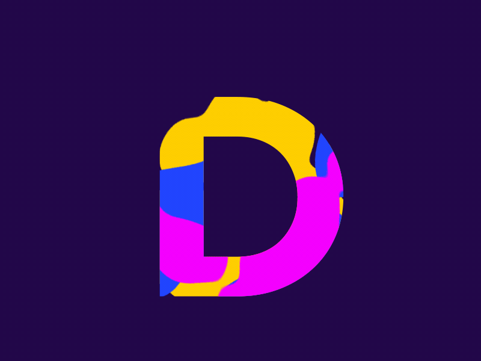
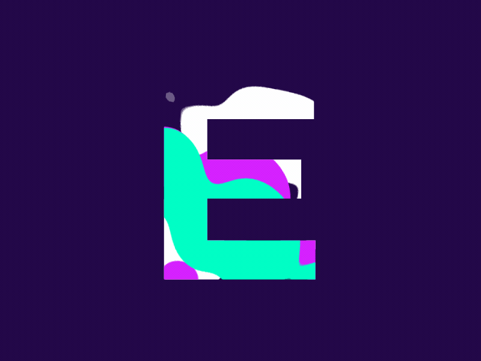
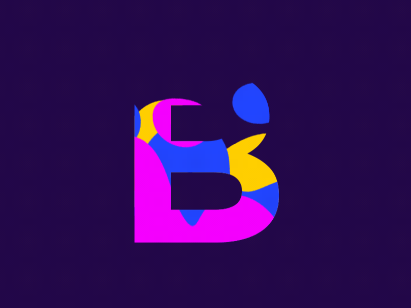
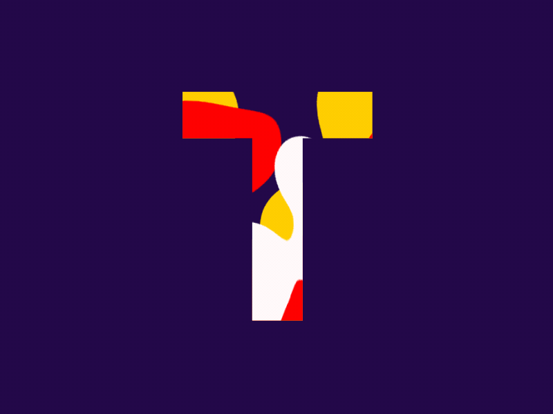
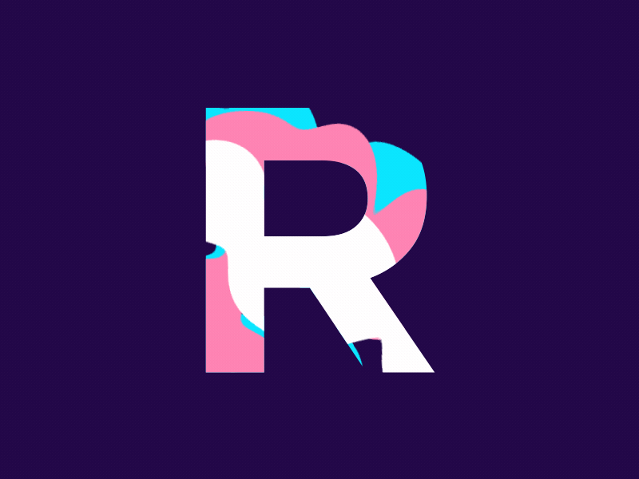

<!--
    
-->
<!--
    
-->

    

        
        
        
        
        
    

    

        
        
        
        
        
    

    

        
        
        
        
        
    

 

  

    <picture><source media="(prefers-color-scheme: dark)" srcset="https://capsule-render.vercel.app/api?type=transparent&height=140&text=Languages&fontSize=96&fontColor=F0F6FC&fontAlignY=55" /></picture>
    <picture><source media="(prefers-color-scheme: dark)" srcset="https://capsule-render.vercel.app/api?type=transparent&height=140&text=AI%20%26amp%3B%20ML&fontSize=96&fontColor=F0F6FC&fontAlignY=55" /></picture>
    <picture><source media="(prefers-color-scheme: dark)" srcset="https://capsule-render.vercel.app/api?type=transparent&height=140&text=Agents%20%26amp%3B%20LLMs&fontSize=96&fontColor=F0F6FC&fontAlignY=55" /></picture>
    <picture><source media="(prefers-color-scheme: dark)" srcset="https://capsule-render.vercel.app/api?type=transparent&height=140&text=Data%20%26amp%3B%20Apps&fontSize=96&fontColor=F0F6FC&fontAlignY=55" /></picture>
    <picture><source media="(prefers-color-scheme: dark)" srcset="https://capsule-render.vercel.app/api?type=transparent&height=140&text=Tools&fontSize=96&fontColor=F0F6FC&fontAlignY=55" /></picture>

    
    
    <picture><source media="(prefers-color-scheme: dark)" srcset="https://cdn.simpleicons.org/langchain/7FC8FF" /></picture>
    
    

    
    
    <picture><source media="(prefers-color-scheme: dark)" srcset="https://cdn.simpleicons.org/langgraph/7FC8FF" /></picture>
    <picture><source media="(prefers-color-scheme: dark)" srcset="https://raw.githubusercontent.com/pandas-dev/pandas/db853051c2460f2101d887cd594f869b8028bc40/web/pandas/static/img/pandas_mark_white.svg" /></picture>
    

    
    
    <picture><source media="(prefers-color-scheme: dark)" srcset="https://cdn.simpleicons.org/ollama/FFFFFF" /></picture>
    
    

    
    
    
    
    

    
    
    
    
    

    
    
    
    
    

  

<h3 align="center">FIND ME ON</h3>

  
  
  

  

