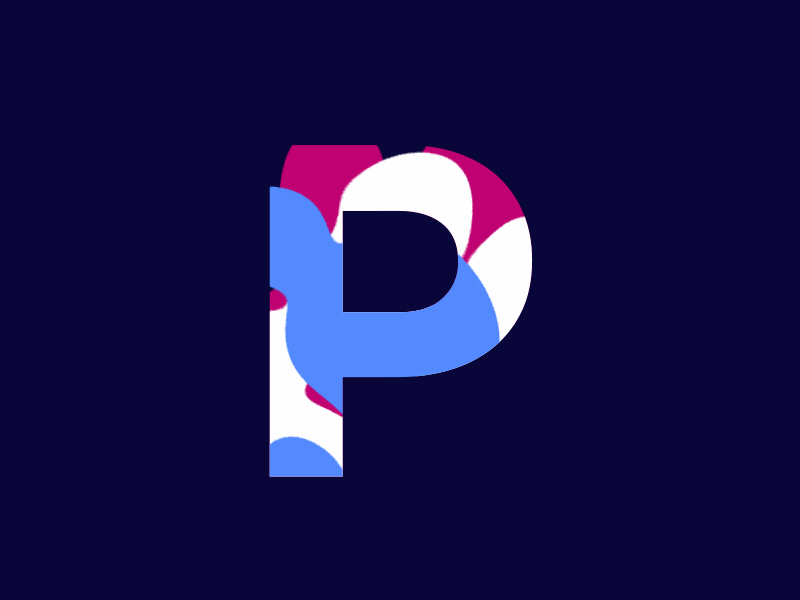
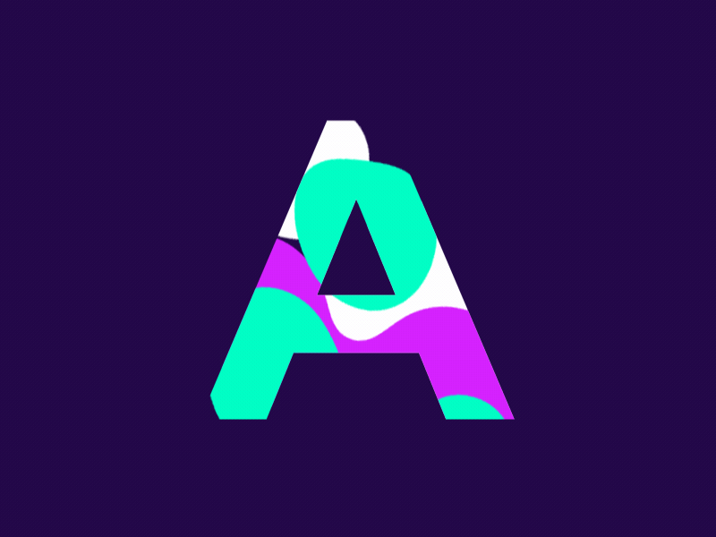
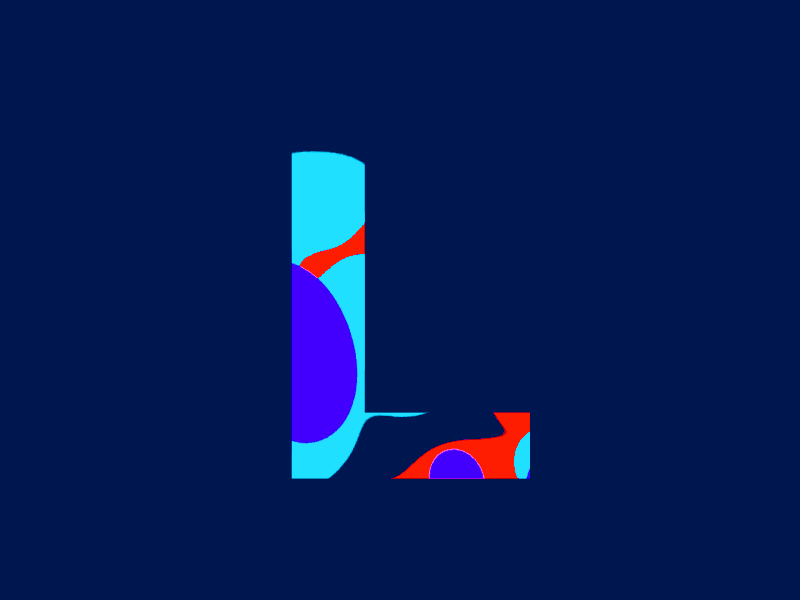
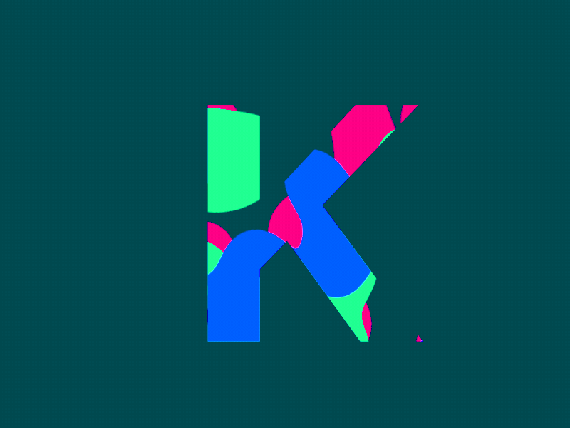
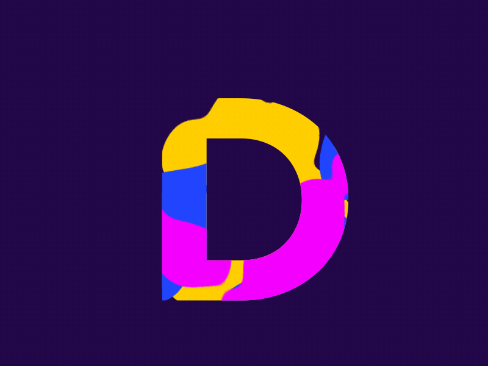
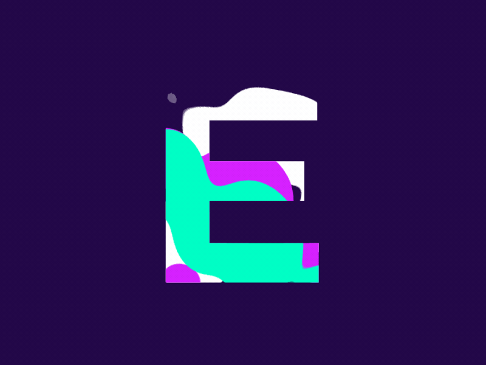
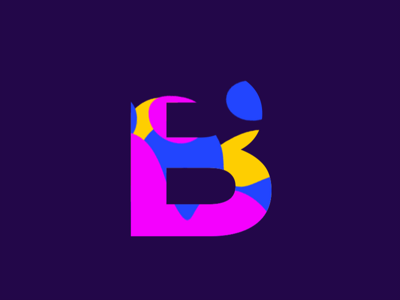
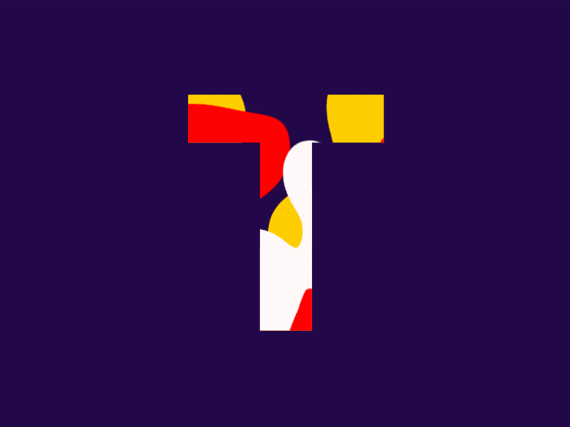
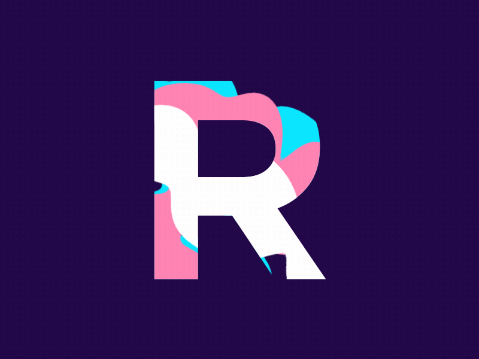

<!--
    
-->
<!--
    
-->

    

    

    

 

<!-- 

  

 -->

<table align="center">
<tr><td><b>LANGUAGES</b></td><td></td></tr>
<tr><td><b>ML</b></td><td></td></tr>
<tr><td><b>AI</b></td><td> </td></tr>
<tr><td><b>NLP</b></td><td>  </td></tr>
<tr><td><b>COMPUTER VISION</b></td><td></td></tr>
<tr><td><b>DATABASES</b></td><td> </td></tr>
<tr><td><b>JS FRAMEWORKS</b></td><td></td></tr>
<tr><td><b>DEPLOYMENT</b></td><td></td></tr>
<tr><td><b>LLMs</b></td><td>   </td></tr>
<tr><td><b>TOOLS</b></td><td>   </td></tr>
</table>

<!-- 

  

 -->

<!-- 

  
  
  

 -->

  

